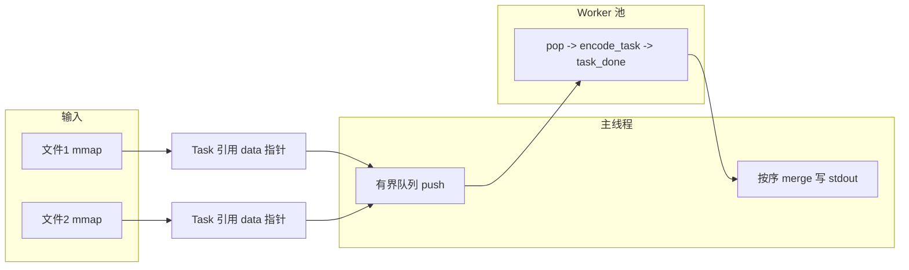

# Lab 3: nyuenc — 改进总结（相对上一版）

本文档概括从「仅通过 Milestone 1 / 打包错误 / 线程池被判错或超时」到 **Gradescope 满分** 之间，代码与提交方式上的主要变化，便于复习与写报告。

---

## 1. 提交方式（非代码，但曾直接导致 0 分编译失败）

| 问题 | 原因 | 做法 |
|------|------|------|
| Autograder 报 `no makefile found` | 压缩包根目录下没有 `Makefile`，多包了一层目录 | 打 zip 时让 **`Makefile` 与 `nyuenc.c` 位于压缩包根**，不要只压缩外层文件夹 |

---

## 2. 并发模型：从「假线程池」到符合作业要求的线程池

### 2.1 早期版本的问题（Milestone 1 能过，Milestone 2 被判错）

- **任务表一次性建好**，worker 只用全局计数器 `next_task++` 抢下标。
- **主线程先 `pthread_join` 全部 worker**，再单线程按序 `submit_task_locked` 合并输出。

这与作业说明中的两点不符：

1. **投递阶段**：主线程应在向「任务队列」提交任务的同时，worker 已在消费（生产者–消费者重叠）。
2. **收集阶段**：主线程应在按序收集/合并结果的同时，worker 仍可处理后续任务（而不是等所有编码结束再合并）。

因此 Autograder 会判定 **未正确使用 thread pool**，跳过 Milestone 2。

### 2.2 改进后的模型（核心思想）

- **有界环形队列** `q_buf[Q_CAP]`：主线程 **push** 任务 id，worker **pop** 后执行 `encode_task`。
- **主线程在 join 之前**进入循环：在 **能 push 时 push**、在 **`task_done[merged]` 为真时 merge**，与 worker **并行**。
- **`TASK_SENTINEL`**：全部任务 merge 完毕后，向队列投入与线程数相等的哨兵，worker 取到哨兵后 `return`，便于 `pthread_join` 收尾。

---

## 3. 同步与超时：从「卡死 600 秒」到稳定结束

### 3.1 曾出现的问题

使用 **两个条件变量分别等待「队列非满」与「任务完成」** 时，在部分调度/队列状态下，可能出现：

- 主线程等在 **A** 条件变量上，
- 而实际进展只触发了 **B** 上的 `signal`，

导致长时间无人唤醒 → **600 秒超时**。

### 3.2 改进：`pool_cv` + 显式等待谓词（Mesa 语义）

- 使用 **`pool_cv`**，主线程在下列条件 **至少满足其一** 前阻塞：

  - 还能继续提交：`(next_submit < task_count && q_count < Q_CAP)`  
  - 或当前该合并的任务已完成：`task_done[merged]`

- 用 **`while (!(谓词)) { pthread_cond_wait(&pool_cv, &lock); }`**，避免虚假唤醒与条件遗漏。
- worker 在 **pop 后** 与 **置 `task_done` 后** 对 `pool_cv` 发 **`pthread_cond_signal`**，保证主线程会重新检查谓词。

（`q_not_empty` 仍单独用于 worker 在空队列上等待；与「主线程等进度/空间」分离，职责清晰。）

---

## 4. 性能：相对「仅正确线程池」版本的改进

作业说明强调：**编码应对输入只做线性扫描**，并避免把线程时间耗在锁竞争上。

### 4.1 输入：`malloc` + `fread` 全量拷贝 → `mmap`

| 维度 | 旧做法 | 新做法 |
|------|--------|--------|
| 读文件 | 先扫长度再整块 `fread` 到 `all_data` | 每文件 **`open` + `fstat` + `mmap(MAP_PRIVATE)`** |
| 内存 | 一份用户空间堆拷贝 | 直接通过映射地址访问，**避免大块显式拷贝**（按需由 OS 页调入） |
| 任务 | `start` 相对整块缓冲偏移 | 每个 `Task` 带 **`const uint8_t *data`**，指向该文件映射基址 + 文件内 `start` |
| 退出 | `free(all_data)` | **`munmap`** 各文件映射 |

这与讲义中「可考虑 `mmap`、lazy 装入」的建议一致。

### 4.2 任务粒度：`TASK_SIZE` 4KB → 64KB

- 更少的任务个数 → 更少的 **入队/出队、条件变量、锁操作**。
- 在保持按块并行编码的前提下，降低同步开销占整体时间的比例。

### 4.3 条件变量：`broadcast` → `signal`（热点路径）

- 在「每次只推进一个等待者即可」的路径上，用 **`pthread_cond_signal`** 替代 **`pthread_cond_broadcast`**，减轻 **惊群** 与无效唤醒，有利于多线程下 CPU 利用。

---

## 5. 最终数据流（简图）



---

## 6. 文件与构建

- **源码**：`nyuenc.c`（`-pthread`，POSIX `mmap` / `pthread`）。
- **构建**：`Makefile` 目标 `nyuenc`，与 Autograder 在根目录执行 `make` 一致。

---

## 7. 小结表：「这一版」相对「上一版」多做了什么

| 类别 | 改进点 |
|------|--------|
| 提交 | zip 根目录含 `Makefile` + `nyuenc.c` |
| 正确性（M2） | 有界队列 + 主线程与 worker 重叠 submit / merge + sentinel 退出 |
| 稳定性 | `pool_cv` + 统一等待谓词，避免错误 cv 上长睡 |
| I/O | `mmap` 替代全量 `fread` 拷贝 |
| 性能 | `TASK_SIZE` 64KB；热点处 `signal` 减少唤醒风暴 |

---

## 8. 本地建议自测命令（可选）

```bash
make clean && make
# 单线程与多线程输出应一致（同一输入）
cmp <(./nyuenc input.bin) <(./nyuenc -j 8 input.bin)
```

---

*文档生成目的：记录从初版到满分通过的主要设计决策，便于课程报告与答辩。*
